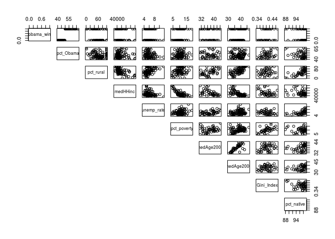
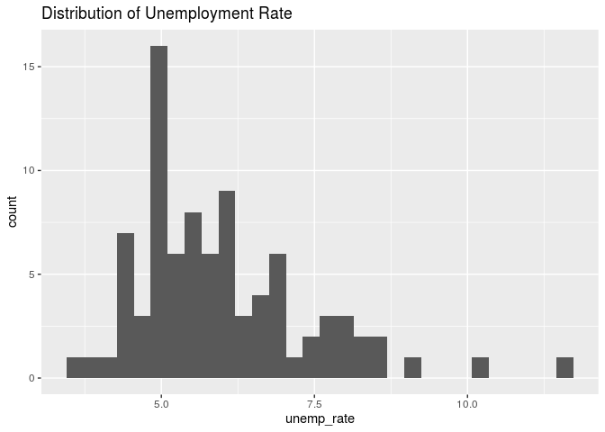
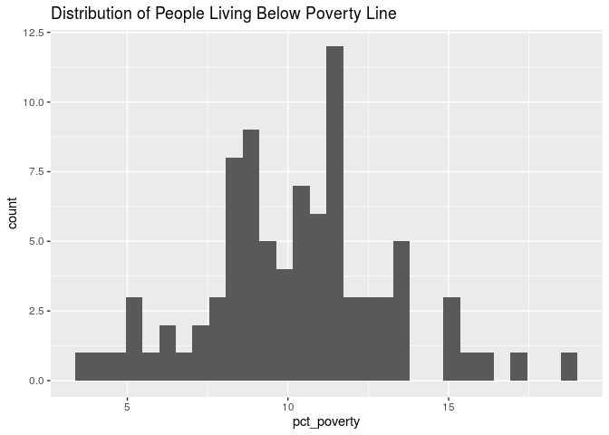
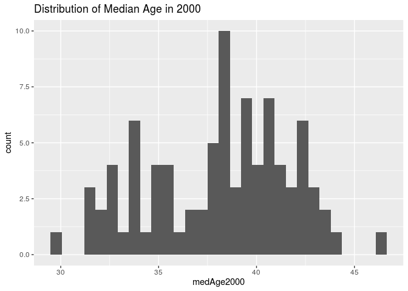

HW 05: Logistic Regression
================
Hannah Wang
30 October 2019

### Load data and packages

``` r
library(tidyverse)
library(knitr)
library(broom)
library(pROC)
library(skimr)
```

``` r
mn08 <- read.csv("data/mn08.csv")
```

### Question 1

``` r
odds_behind <- (18/20) / (1 - 18/20)
odds_tied <- (71/90) / (1 - 71/90)
odds_ahead <- (55/75) / (1 - 55/75)

odds_behind
```

    ## [1] 9

``` r
odds_tied
```

    ## [1] 3.736842

``` r
odds_ahead
```

    ## [1] 2.75

The odds of a successful penalty kick for games in which the
goalkeeper’s team was behind is 9, tied is 3.74, and ahead is 2.75.

``` r
odds_behind/odds_tied
```

    ## [1] 2.408451

``` r
odds_tied/odds_ahead
```

    ## [1] 1.358852

The odds ratios for successful penalty kicks for behind versus tied is
2.41, and tied versus ahead is 1.36.

### Question 2

The odds of children in day care centers getting nightly cough is
expected to be, on average, 1.89 times the odds of children in home care
getting nightly cough. We are 95% confident that the true odds ratio
lies between 1.34 and 1.67, meaning we are 95% confident that the odds
of children in day care centers getting nightly cough is 1.34 to 1.67
times the odds of children in home care getting nightly cough.

The odds of children getting a blocked or runny nose without common cold
in day care is expected to be, on average, 1.55 times the odds of
getting it in home care. We are 95% confident that the true odds ratio
lies between 1.07 and 1.61, meaning we are 95% confident that the odds
of children getting a blocked or runny nose without common cold in day
care is 1.07 to 1.61 times the odds of getting it in home care.

### Question 3

log odds-hat = -1.123 + 0.018 \* distance + 0.374 \* morphlight - 0.028
\* distance:morphlight

When distance from Liverpool is 0 and the moth is dark, the log odds of
a moth being removed is -1.123.

Holding all else constant, as distance from Liverpool increases by 1 km,
we expect the log odds of a moth being removed to increase by 0.018.

Holding all else constant, the difference in the log odds of a light
moth being removed and the log odds of a dark moth being removed is
0.374.

Holding all else constant, as distance from Liverpool increases by 1 km,
we expect the difference in log odds of a light moth being removed and a
dark moth being removed to decrase by 0.028.

### Question 4

When distance from Liverpool is 0 and the moth is dark, the odds of a
moth being removed is exp(-1.123) = 0.325.

Holding all else constant, as distance from Liverpool increases by 1 km,
we expect the odds of a moth being removed to multiply by a factor of
exp(0.018) = 1.02.

Holding all else constant, the odds of a light moth being removed is
expected to be exp(0.374) = 1.45 times the odds of a dark moth being
removed.

Holding all else constant, as distance from Liverpool increases by 1 km,
we expect the odds of a light moth being removed to be exp(-0.028) =
0.972 times the odds of a dark moth being removed.

### Question 5

log odds = -1.123 + 0.018(7.2) + 0.374(0) - 0.028(0)

The predicted log odds of being removed for a dark moth that is glued to
the trunk of a tree 7.2 km from Liverpool is -0.9934.

The predicted odds of being removed for a dark moth that is glued to the
trunk of a tree 7.2 km from Liverpool is exp(-0.9934) = 0.3703.

### Question 6

log odds = -1.123 + 0.018(41.5) + 0.374(1) - 0.028(41.5)

The predicted probability of being removed for a light moth that is
glued to the trunk of a tree 41.5 km from Liverpool is -1.164.

### Question 7

#### Introduction

The objective is to fit a logistic model that can be used to predict
whether the Democratic candidate will win given county in Minnesota
baesd on the characteristics of that county.

The response variable is categorical, and indicates whether or not Obama
won the majority vote (1 is won, 0 is otherwise).

``` r
mn08 <- mn08 %>%
  mutate(obama_win = case_when(pct_Obama > 50 ~ 1,
                               pct_Obama <= 50 ~ 0))
```

#### Exploratory Data Analysis

Initially, we can eliminate the variables County, Obama, McCain,
pct\_Obama. County is just the identifier for the the observations.
Obama and McCain are the variables used to calculate the response
variable, whether Obama won, so they would directly predict the
response.

Thus, we will combine Obama and McCain to create a new variable
`total_votes` to give us more information about the population.

``` r
mn08 <- mn08 %>%
  mutate(total_votes = Obama + McCain)
```

``` r
skim(mn08)
```

    ## Skim summary statistics
    ##  n obs: 87 
    ##  n variables: 14 
    ## 
    ## ── Variable type:factor ───────────────────────────────────────────────
    ##  variable missing complete  n n_unique                     top_counts
    ##    County       0       87 87       87 Ait: 1, Ano: 1, Bec: 1, Bel: 1
    ##  ordered
    ##    FALSE
    ## 
    ## ── Variable type:integer ──────────────────────────────────────────────
    ##     variable missing complete  n     mean       sd    p0     p25   p50
    ##       McCain       0       87 87 14659.77 30265.89   843  2815.5  6315
    ##     medHHinc       0       87 87 47813.24  9902.28 34503 41954   44602
    ##        Obama       0       87 87 18084.17 50990.7    971  2849    5646
    ##  total_votes       0       87 87 32743.94 80591.3   1974  5703   11581
    ##    p75   p100     hist
    ##  11117 231057 ▇▁▁▁▁▁▁▁
    ##  49902  80038 ▂▇▃▁▁▁▁▁
    ##  11812 420958 ▇▁▁▁▁▁▁▁
    ##  21611 652015 ▇▁▁▁▁▁▁▁
    ## 
    ## ── Variable type:numeric ──────────────────────────────────────────────
    ##     variable missing complete  n  mean    sd    p0   p25   p50   p75
    ##   Gini_Index      40       47 87  0.4   0.03  0.34  0.39  0.4   0.42
    ##   medAge2000       0       87 87 38.13  3.58 29.9  35.2  38.4  40.65
    ##   medAge2007      40       47 87 37.41  3.52 31.1  34.65 37.4  40   
    ##    obama_win       0       87 87  0.48  0.5   0     0     0     1   
    ##   pct_native      40       47 87 96.53  2.83 87.92 95.32 97.42 98.56
    ##    pct_Obama       0       87 87 50.19  6.81 40.03 44.96 49.3  53.76
    ##  pct_poverty       0       87 87 10.26  2.87  3.9   8.5  10.3  11.7 
    ##    pct_rural       0       87 87 63.46 27.33  0    46    64    83   
    ##   unemp_rate       0       87 87  6.01  1.43  3.6   5     5.7   6.75
    ##    p100     hist
    ##    0.47 ▂▅▁▇▇▃▂▁
    ##   46.5  ▂▅▃▆▇▆▃▁
    ##   44.2  ▃▅▅▆▃▇▃▂
    ##    1    ▇▁▁▁▁▁▁▇
    ##   99.34 ▁▁▁▁▁▂▅▇
    ##   67.29 ▇▇▅▇▃▂▂▁
    ##   19    ▂▂▇▇▅▂▁▁
    ##  100    ▁▂▃▅▅▆▃▇
    ##   11.6  ▃▇▆▃▂▁▁▁

Gini\_Index, medAge2007, and pct\_native have 40 missing observations,
so we should look into eliminating those variables (see if they have
high correlations with any other predictor
variables).

``` r
pairs(data = mn08, obama_win ~ pct_Obama + pct_rural + medHHinc + unemp_rate + pct_poverty + medAge2007 + medAge2000 + Gini_Index + pct_native, lower.panel = NULL)
```

<!-- -->

``` r
mn08 %>%
  select(-obama_win, -County) %>%
  cor()
```

    ##                   Obama     McCain   pct_Obama   pct_rural    medHHinc
    ## Obama        1.00000000  0.9651146  0.34173832 -0.46015113  0.34698667
    ## McCain       0.96511460  1.0000000  0.23423773 -0.53844419  0.47999415
    ## pct_Obama    0.34173832  0.2342377  1.00000000 -0.09592057 -0.07688084
    ## pct_rural   -0.46015113 -0.5384442 -0.09592057  1.00000000 -0.60032961
    ## medHHinc     0.34698667  0.4799941 -0.07688084 -0.60032961  1.00000000
    ## unemp_rate  -0.14660182 -0.1606066 -0.19385008  0.43951388 -0.28575709
    ## pct_poverty -0.06503278 -0.1648618  0.14349637  0.29792302 -0.75933728
    ## medAge2007           NA         NA          NA          NA          NA
    ## medAge2000  -0.27522752 -0.3508677  0.02549209  0.67827155 -0.65110581
    ## Gini_Index           NA         NA          NA          NA          NA
    ## pct_native           NA         NA          NA          NA          NA
    ## total_votes  0.99515397  0.9861829  0.30418780 -0.49335252  0.39980175
    ##             unemp_rate pct_poverty medAge2007  medAge2000 Gini_Index
    ## Obama       -0.1466018 -0.06503278         NA -0.27522752         NA
    ## McCain      -0.1606066 -0.16486177         NA -0.35086770         NA
    ## pct_Obama   -0.1938501  0.14349637         NA  0.02549209         NA
    ## pct_rural    0.4395139  0.29792302         NA  0.67827155         NA
    ## medHHinc    -0.2857571 -0.75933728         NA -0.65110581         NA
    ## unemp_rate   1.0000000  0.27358320         NA  0.24074490         NA
    ## pct_poverty  0.2735832  1.00000000         NA  0.27259938         NA
    ## medAge2007          NA          NA          1          NA         NA
    ## medAge2000   0.2407449  0.27259938         NA  1.00000000         NA
    ## Gini_Index          NA          NA         NA          NA          1
    ## pct_native          NA          NA         NA          NA         NA
    ## total_votes -0.1530715 -0.10306019         NA -0.30590606         NA
    ##             pct_native total_votes
    ## Obama               NA   0.9951540
    ## McCain              NA   0.9861829
    ## pct_Obama           NA   0.3041878
    ## pct_rural           NA  -0.4933525
    ## medHHinc            NA   0.3998018
    ## unemp_rate          NA  -0.1530715
    ## pct_poverty         NA  -0.1030602
    ## medAge2007          NA          NA
    ## medAge2000          NA  -0.3059061
    ## Gini_Index          NA          NA
    ## pct_native           1          NA
    ## total_votes         NA   1.0000000

From the pairs plot and correlation matrix, we see that: medAge2000 and
medAge2007 are highly correlated, so we can eliminate medAge2007 because
it has a lot of missing observations.

Gini\_Index and pct\_poverty are highly correlated, so we can eliminate
Gini\_Index because it has a lot of missing observations.

pct\_rural and pct\_native are highly correlated, so we can eliminate
pct\_native because it has a lot of missing observations.

It would be beneficial to eliminate these variables because they are
potentially collinear with other predictor variables, which causes
biased estimates of the regression parameters. They also have many
missing observations (about half the data), which would cause problems
in model fitting.

##### Univariate Analysis

Created histograms to visualize the distribution of remaining predictor
variables.

``` r
ggplot(data = mn08, mapping = aes(x = medHHinc)) + geom_histogram() + labs(title = "Distribution of Median Household Income")
```

<!-- -->

``` r
ggplot(data = mn08, mapping = aes(x = unemp_rate)) + geom_histogram() + labs(title = "Distribution of Unemployment Rate")
```

<!-- -->

``` r
ggplot(data = mn08, mapping = aes(x = pct_poverty)) + geom_histogram() + labs(title = "Distribution of People Living Below Poverty Line")
```

<!-- -->

``` r
ggplot(data = mn08, mapping = aes(x = medAge2000)) + geom_histogram() + labs(title = "Distribution of Median Age in 2000")
```

<!-- -->

The distributions for median household income and unemployment rate are
skewed right, while the distributions for people living below poverty
line and median age are relatively normally distributed.

##### Bivariate Analysis

Created box plots to visualize quantitative predictor variables
vs. categorical response variable of whether or not Obama won majority
vote.

``` r
mn08 %>%
  group_by(obama_win) %>%
  ggplot(mapping = aes(x = factor(obama_win), y = medHHinc)) + geom_boxplot() + labs(title = "Median Household Income vs. Obama Majority Win", y = "Median Household Income", x = "Obama Majority Win")
```

<!-- -->

``` r
mn08 %>%
  group_by(obama_win) %>%
  ggplot(mapping = aes(x = factor(obama_win), y = unemp_rate)) + geom_boxplot() + labs(title = "Unemployment Rate vs. Obama Majority Win", y = "Unemployment Rate", x = "Obama Majority Win")
```

<!-- -->

``` r
mn08 %>%
  group_by(obama_win) %>%
  ggplot(mapping = aes(x = factor(obama_win), y = pct_poverty)) + geom_boxplot() + labs(title = "Percent below Poverty Line vs. Obama Majority Win", y = "Percent below Poverty Line", x = "Obama Majority Win")
```

<!-- -->

``` r
mn08 %>%
  group_by(obama_win) %>%
  ggplot(mapping = aes(x = factor(obama_win), y = medAge2000)) + geom_boxplot() + labs(title = "Median Age in 2000 vs. Obama Majority Win", y = "Median Age in 2000", x = "Obama Majority Win")
```

<!-- -->

#### Model Fitting

``` r
full_model <- glm(obama_win ~ pct_rural + medHHinc + unemp_rate + pct_poverty + medAge2000, data = mn08)
kable(tidy(full_model,conf.int=TRUE),digits=5)
```

|       term       |    estimate    |    std.error    |   statistic    |    p.value    |    conf.low    |                         conf.high                          |
| :--------------: | :------------: | :-------------: | :------------: | :-----------: | :------------: | :--------------------------------------------------------: |
|   (Intercept)    |  \-1.8786409   |    1.5173531    |  \-1.2381040   |   0.2192541   |  \-4.8525982   |                         1.0953165                          |
|    pct\_rural    |   0.0002623    |    0.0029895    |   0.0877457    |   0.9302953   |  \-0.0055970   |                         0.0061216                          |
|     medHHinc     |   0.0000158    |    0.0000121    |   1.3016993    |   0.1967092   |  \-0.0000080   |                         0.0000396                          |
|   unemp\_rate    |  \-0.0787611   |    0.0422130    |  \-1.8658024   |   0.0656890   |  \-0.1614971   |                         0.0039748                          |
|   pct\_poverty   |   0.0730109    |    0.0325339    |   2.2441469    |   0.0275514   |   0.0092456    |                         0.1367763                          |
|    medAge2000    |   0.0344336    |    0.0237389    |   1.4505136    |   0.1507769   |  \-0.0120938   |                         0.0809610                          |
| obama\_win-hat = | \-1.87864 + 0. | 00026 \* pct\_r | ural + 0.00002 | \* medHHinc - | 0.07876 \* une | mp\_rate + 0.07301 \* pct\_poverty + 0.03443 \* medAge2000 |

``` r
regfit_backward <- step(full_model, direction = "backward")
```

    ## Start:  AIC=130.73
    ## obama_win ~ pct_rural + medHHinc + unemp_rate + pct_poverty + 
    ##     medAge2000
    ## 
    ##               Df Deviance    AIC
    ## - pct_rural    1   19.489 128.74
    ## - medHHinc     1   19.895 130.53
    ## <none>             19.487 130.73
    ## - medAge2000   1   19.993 130.96
    ## - unemp_rate   1   20.325 132.39
    ## - pct_poverty  1   20.699 133.98
    ## 
    ## Step:  AIC=128.74
    ## obama_win ~ medHHinc + unemp_rate + pct_poverty + medAge2000
    ## 
    ##               Df Deviance    AIC
    ## - medHHinc     1   19.916 128.62
    ## <none>             19.489 128.74
    ## - medAge2000   1   20.107 129.45
    ## - unemp_rate   1   20.433 130.85
    ## - pct_poverty  1   20.723 132.08
    ## 
    ## Step:  AIC=128.62
    ## obama_win ~ unemp_rate + pct_poverty + medAge2000
    ## 
    ##               Df Deviance    AIC
    ## - medAge2000   1   20.127 127.54
    ## <none>             19.916 128.62
    ## - unemp_rate   1   20.855 130.63
    ## - pct_poverty  1   20.856 130.64
    ## 
    ## Step:  AIC=127.54
    ## obama_win ~ unemp_rate + pct_poverty
    ## 
    ##               Df Deviance    AIC
    ## <none>             20.127 127.54
    ## - unemp_rate   1   20.939 128.98
    ## - pct_poverty  1   21.334 130.61

``` r
final_model <- glm(obama_win ~ unemp_rate + pct_poverty, data = mn08)
kable(tidy(final_model,conf.int=TRUE),digits=5)
```

|     term     |  estimate   | std.error | statistic  |  p.value  |  conf.low   | conf.high |
| :----------: | :---------: | :-------: | :--------: | :-------: | :---------: | :-------: |
| (Intercept)  |  0.4664885  | 0.2636848 |  1.769114  | 0.0805045 | \-0.0503243 | 0.9833013 |
| unemp\_rate  | \-0.0705809 | 0.0383348 | \-1.841170 | 0.0691267 | \-0.1457158 | 0.0045539 |
| pct\_poverty |  0.0429192  | 0.0191188 |  2.244869  | 0.0274043 |  0.0054470  | 0.0803914 |

obama\_win-hat = 0.4665 - 0.0706 \* unemp\_rate + 0.0429 \* pct\_poverty

``` r
model_aug <- augment(final_model)
```

``` r
arm::binnedplot(x = model_aug$.fitted,
                y=model_aug$.resid,
                xlab="Predicted Probabilities",
                main = "Binned Residuals vs. Predicted Probabilities",
                col.int = FALSE)
```

<!-- -->

``` r
arm::binnedplot(x = model_aug$unemp_rate,
                y = model_aug$.resid,
                xlab= "Unemployment Rate",
                main = "Binned Residuals vs. Unemployment Rate",
                col.int = FALSE)
```

<!-- -->

``` r
arm::binnedplot(x = model_aug$pct_poverty,
                y = model_aug$.resid,
                xlab= "Percent Below Poverty Line",
                main = "Binned Residuals vs. Poverty Rate",
                col.int = FALSE)
```

<!-- -->

The binned residuals across predicted probabilities and the
quantitiative predictor variables in the final model (unemp\_rate and
pct\_poverty) are randomly distributed around 0 and have small
magnitudes. Thus, the final model is an appropriate fit for the data.

#### Analysis

``` r
library(plotROC)
roccurve <- ggplot(model_aug, aes(d = as.numeric(obama_win), m = .fitted)) +
geom_roc(n.cuts = 5, labelround = 3) + geom_abline(intercept = 0)
roccurve
```

<!-- -->

``` r
calc_auc(roccurve)$AUC
```

    ## [1] 0.6449735

From the model, we decide on a threshold probability of 0.479, with a
false positive rate of 0.4 and a true positive rate of 0.6 because thsi
is the point on the ROC curve closest to the top left corner (true
positive rate of 1).

### Overall
