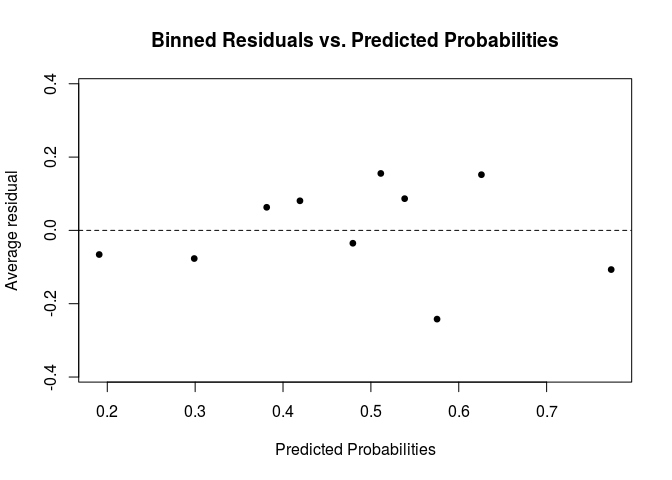
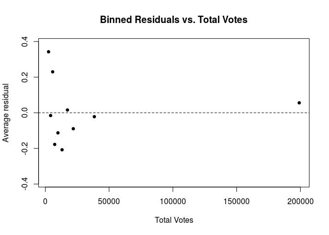
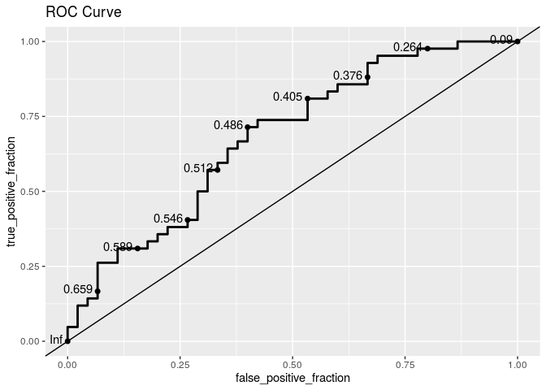

HW 05: Logistic Regression
================
Hannah Wang
06 November 2019

### Load data and packages

``` r
library(tidyverse)
library(knitr)
library(broom)
library(pROC)
library(skimr)
library(rms)
```

``` r
mn08 <- read.csv("data/mn08.csv")
```

### Question 1

``` r
odds_behind <- (18/20) / (1 - 18/20)
odds_tied <- (71/90) / (1 - 71/90)
odds_ahead <- (55/75) / (1 - 55/75)

odds_behind
```

    ## [1] 9

``` r
odds_tied
```

    ## [1] 3.736842

``` r
odds_ahead
```

    ## [1] 2.75

The odds of a successful penalty kick for games in which the
goalkeeper’s team was behind is 9, tied is 3.74, and ahead is 2.75.

``` r
odds_behind/odds_tied
```

    ## [1] 2.408451

``` r
odds_tied/odds_ahead
```

    ## [1] 1.358852

The odds ratios for successful penalty kicks for behind versus tied is
2.41, and tied versus ahead is 1.36.

### Question 2

The odds of children in day care centers getting nightly cough is
expected to be, on average, 1.89 times the odds of children in home care
getting nightly cough. We are 95% confident that the interval 1.34 to
1.67 contains the true odds ratio of children getting nightly cough in
day care centers vs. in home care centers.

The odds of children getting a blocked or runny nose without common cold
in day care is expected to be, on average, 1.55 times the odds of
getting it in home care. We are 95% confident that the interval 1.07 to
1.61 contains the true odds ratio of children getting blocked or runny
nose without a common cold in day care centers vs. in home care centers.

### Question 3

log-odds-hat = -1.123 + 0.018 \* distance + 0.374 \* morphlight - 0.028
\* distance:morphlight

If a moth is dark and its distance from Liverpool is 0, the log odds of
the moth being removed after 24 hours is -1.123.

Holding all else constant, as distance from Liverpool increases by 1 km,
we expect the log odds of a moth being removed after 24 hours to
increase by 0.018.

Holding all else constant, the difference in the log odds of a light
moth being removed and the log odds of a dark moth being removed after
24 hours is 0.374.

Holding all else constant, if a moth is light, as distance from
Liverpool increases by 1 km, we expect the log odds of the moth being
removed after 24 hours to decrease by 0.01.

### Question 4

If a moth is dark and its distance from Liverpool is 0, the odds of the
moth being removed after 24 hours is exp(-1.123) = 0.325.

Holding all else constant, as distance from Liverpool increases by 1 km,
we expect the odds of a moth being removed after 24 hours to multiply by
a factor of exp(0.018) = 1.02.

Holding all else constant, the odds of a light moth being removed is
expected to be exp(0.374) = 1.45 times the odds of a dark moth being
removed after 24 hours.

Holding all else constant, if a moth is light, as distance from
Liverpool increases by 1 km, we expect the odds of a moth being removed
after 24 hours to multiply by a factor of exp(-0.01) = 0.99.

### Question 5

log-odds = -1.123 + 0.018(7.2) + 0.374(0) - 0.028(0) = -0.9934

The predicted log odds of being removed for a dark moth that is glued to
the trunk of a tree 7.2 km from Liverpool is -0.9934.

The predicted odds of being removed for a dark moth that is glued to the
trunk of a tree 7.2 km from Liverpool is exp(-0.9934) = 0.3703.

### Question 6

log-odds = -1.123 + 0.018(41.5) + 0.374(1) - 0.028(41.5) = -1.164

The predicted probability of being removed for a light moth that is
glued to the trunk of a tree 41.5 km from Liverpool is
exp(-1.164)/(1+exp(-1.164)) = 0.2379.

### Question 7

#### Introduction

The objective is to fit a logistic model that can be used to predict
whether the Democratic candidate will win given county in Minnesota
baesd on the characteristics of that county.

The response variable is categorical, and indicates whether or not Obama
won the majority vote (1 is won, 0 is otherwise).

``` r
mn08 <- mn08 %>%
  mutate(obama_win = case_when(pct_Obama > 50 ~ 1,
                               pct_Obama <= 50 ~ 0))
```

``` r
ggplot(data = mn08, mapping = aes(x = factor(obama_win), stat = "identity")) + geom_bar() + labs(title = "Distribution of Whether Obama Won", x = "Obama Majority Win", y = "Proportion")
```

<!-- -->

``` r
mn08 %>%
  count(obama_win) %>%
  mutate(prop = n/sum(n))
```

    ## # A tibble: 2 x 3
    ##   obama_win     n  prop
    ##       <dbl> <int> <dbl>
    ## 1         0    45 0.517
    ## 2         1    42 0.483

Out of the 87 counties in Minnesota, Obama won the majority vote in 42
and lost in 45. He won in 0.48 of the counties and lost in 0.52 of the
counties.

#### Exploratory Data Analysis

Initially, we can eliminate the variables County, Obama, McCain,
pct\_Obama. County is just the identifier for the the observations.
Obama, McCain, and pct\_Obama are the variables used to calculate the
response variable (whether Obama won) so they would directly predict the
response.

We will combine Obama and McCain to create a new variable `total_votes`
to give us more information about the population.

``` r
mn08 <- mn08 %>%
  mutate(total_votes = Obama + McCain)
```

We use the `skim` function to get a quick overview of the distribution
of the remaining variables.

``` r
skim(mn08)
```

    ## Skim summary statistics
    ##  n obs: 87 
    ##  n variables: 14 
    ## 
    ## ── Variable type:factor ──────────────────────────────────────────────────────
    ##  variable missing complete  n n_unique                     top_counts
    ##    County       0       87 87       87 Ait: 1, Ano: 1, Bec: 1, Bel: 1
    ##  ordered
    ##    FALSE
    ## 
    ## ── Variable type:integer ─────────────────────────────────────────────────────
    ##     variable missing complete  n     mean       sd    p0     p25   p50
    ##       McCain       0       87 87 14659.77 30265.89   843  2815.5  6315
    ##     medHHinc       0       87 87 47813.24  9902.28 34503 41954   44602
    ##        Obama       0       87 87 18084.17 50990.7    971  2849    5646
    ##  total_votes       0       87 87 32743.94 80591.3   1974  5703   11581
    ##    p75   p100     hist
    ##  11117 231057 ▇▁▁▁▁▁▁▁
    ##  49902  80038 ▂▇▃▁▁▁▁▁
    ##  11812 420958 ▇▁▁▁▁▁▁▁
    ##  21611 652015 ▇▁▁▁▁▁▁▁
    ## 
    ## ── Variable type:numeric ─────────────────────────────────────────────────────
    ##     variable missing complete  n  mean    sd    p0   p25   p50   p75
    ##   Gini_Index      40       47 87  0.4   0.03  0.34  0.39  0.4   0.42
    ##   medAge2000       0       87 87 38.13  3.58 29.9  35.2  38.4  40.65
    ##   medAge2007      40       47 87 37.41  3.52 31.1  34.65 37.4  40   
    ##    obama_win       0       87 87  0.48  0.5   0     0     0     1   
    ##   pct_native      40       47 87 96.53  2.83 87.92 95.32 97.42 98.56
    ##    pct_Obama       0       87 87 50.19  6.81 40.03 44.96 49.3  53.76
    ##  pct_poverty       0       87 87 10.26  2.87  3.9   8.5  10.3  11.7 
    ##    pct_rural       0       87 87 63.46 27.33  0    46    64    83   
    ##   unemp_rate       0       87 87  6.01  1.43  3.6   5     5.7   6.75
    ##    p100     hist
    ##    0.47 ▂▅▁▇▇▃▂▁
    ##   46.5  ▂▅▃▆▇▆▃▁
    ##   44.2  ▃▅▅▆▃▇▃▂
    ##    1    ▇▁▁▁▁▁▁▇
    ##   99.34 ▁▁▁▁▁▂▅▇
    ##   67.29 ▇▇▅▇▃▂▂▁
    ##   19    ▂▂▇▇▅▂▁▁
    ##  100    ▁▂▃▅▅▆▃▇
    ##   11.6  ▃▇▆▃▂▁▁▁

Gini\_Index, medAge2007, and pct\_native have 40 missing observations,
so we should look into eliminating those variables (see if they have
high correlations with any other predictor variables).

We created a pairs plot and correlation matrix to examine the
correlation between the predictor variables and see if there are any
potential
multicollinearities.

``` r
pairs(data = mn08, obama_win ~ pct_rural + medHHinc + unemp_rate + pct_poverty + medAge2007 + medAge2000 + Gini_Index + pct_native + total_votes, lower.panel = NULL)
```

<!-- -->

``` r
mn08 %>%
  select(-obama_win, -County, -Obama, -McCain) %>%
  cor()
```

    ##               pct_Obama   pct_rural    medHHinc unemp_rate pct_poverty
    ## pct_Obama    1.00000000 -0.09592057 -0.07688084 -0.1938501   0.1434964
    ## pct_rural   -0.09592057  1.00000000 -0.60032961  0.4395139   0.2979230
    ## medHHinc    -0.07688084 -0.60032961  1.00000000 -0.2857571  -0.7593373
    ## unemp_rate  -0.19385008  0.43951388 -0.28575709  1.0000000   0.2735832
    ## pct_poverty  0.14349637  0.29792302 -0.75933728  0.2735832   1.0000000
    ## medAge2007           NA          NA          NA         NA          NA
    ## medAge2000   0.02549209  0.67827155 -0.65110581  0.2407449   0.2725994
    ## Gini_Index           NA          NA          NA         NA          NA
    ## pct_native           NA          NA          NA         NA          NA
    ## total_votes  0.30418780 -0.49335252  0.39980175 -0.1530715  -0.1030602
    ##             medAge2007  medAge2000 Gini_Index pct_native total_votes
    ## pct_Obama           NA  0.02549209         NA         NA   0.3041878
    ## pct_rural           NA  0.67827155         NA         NA  -0.4933525
    ## medHHinc            NA -0.65110581         NA         NA   0.3998018
    ## unemp_rate          NA  0.24074490         NA         NA  -0.1530715
    ## pct_poverty         NA  0.27259938         NA         NA  -0.1030602
    ## medAge2007           1          NA         NA         NA          NA
    ## medAge2000          NA  1.00000000         NA         NA  -0.3059061
    ## Gini_Index          NA          NA          1         NA          NA
    ## pct_native          NA          NA         NA          1          NA
    ## total_votes         NA -0.30590606         NA         NA   1.0000000

From the pairs plot and correlation matrix, we see that:

medAge2000 and medAge2007 are highly correlated, so we can eliminate
medAge2007 because it has a lot of missing observations.

Gini\_Index and pct\_poverty are highly correlated, so we can eliminate
Gini\_Index because it has a lot of missing observations.

pct\_rural and pct\_native are highly correlated, so we can eliminate
pct\_native because it has a lot of missing observations.

It would be beneficial to eliminate these variables because they are
potentially collinear with other predictor variables, which causes
biased estimates of the regression parameters. They also have many
missing observations (about half the data), which would cause problems
in model fitting.

##### Univariate Analysis

Created histograms to visualize the distribution of remaining predictor
variables.

``` r
ggplot(data = mn08, mapping = aes(x = medHHinc)) + geom_histogram() + labs(title = "Distribution of Median Household Income")
```

<!-- -->

``` r
mn08 %>%
  summarise(med = median(medHHinc), IQR = IQR(medHHinc))
```

    ##     med  IQR
    ## 1 44602 7948

The distribution of median household income is unimodal and skewed
right, centered around $44,602 with an IQR of $7,948. There appear to be
potential outliers for counties with very high median household
incomes.

``` r
ggplot(data = mn08, mapping = aes(x = unemp_rate)) + geom_histogram() + labs(title = "Distribution of Unemployment Rate")
```

<!-- -->

``` r
mn08 %>%
  summarise(med = median(unemp_rate), IQR = IQR(unemp_rate))
```

    ##   med  IQR
    ## 1 5.7 1.75

The distribution of unemployment rate is unimodal and skewed right,
centered around 5.7% with an IQR of 1.75%. There appear to be potential
outliers for counties with high unemployment
rates.

``` r
ggplot(data = mn08, mapping = aes(x = pct_poverty)) + geom_histogram() + labs(title = "Distribution of People Living Below Poverty Line")
```

<!-- -->

``` r
mn08 %>%
  summarise(med = median(pct_poverty), IQR = IQR(pct_poverty))
```

    ##    med IQR
    ## 1 10.3 3.2

The distribution of percent of people living below the poverty line is
unimodal and relatively normal, centered around 10.3% with an IQR of
3.2%. There do not appear to be any
outliers.

``` r
ggplot(data = mn08, mapping = aes(x = medAge2000)) + geom_histogram() + labs(title = "Distribution of Median Age in 2000")
```

<!-- -->

``` r
mn08 %>%
  summarise(med = median(medAge2000), IQR = IQR(medAge2000))
```

    ##    med  IQR
    ## 1 38.4 5.45

The distribution of median age in 2000 is unimodal and relatively
normal, centered around 38.4 with an IQR of 5.45. There do not appear to
be any potential
outliers.

``` r
ggplot(data = mn08, mapping = aes(x = total_votes)) + geom_histogram() + labs(title = "Distribution of Total Votes")
```

<!-- -->

``` r
mn08 %>%
  summarise(med = median(total_votes), IQR = IQR(total_votes))
```

    ##     med   IQR
    ## 1 11581 15908

The distribution for total votes is strongly skewed right, centered at
11,581 with an IQR of 15,908. There are potential high outliers from
counties in Minnesota that have a large number of total votes, possibly
due to the counties containing major cities.

##### Bivariate Analysis

Created box plots to visualize quantitative predictor variables
vs. categorical response variable of whether or not Obama won majority
vote.

``` r
mn08 %>%
  group_by(obama_win) %>%
  ggplot(mapping = aes(x = factor(obama_win), y = medHHinc)) + geom_boxplot() + labs(title = "Median Household Income vs. Obama Majority Win", y = "Median Household Income", x = "Obama Majority Win")
```

<!-- -->

``` r
mn08 %>%
  group_by(obama_win) %>%
  ggplot(mapping = aes(x = factor(obama_win), y = unemp_rate)) + geom_boxplot() + labs(title = "Unemployment Rate vs. Obama Majority Win", y = "Unemployment Rate", x = "Obama Majority Win")
```

<!-- -->

``` r
mn08 %>%
  group_by(obama_win) %>%
  ggplot(mapping = aes(x = factor(obama_win), y = pct_poverty)) + geom_boxplot() + labs(title = "Percent below Poverty Line vs. Obama Majority Win", y = "Percent below Poverty Line", x = "Obama Majority Win")
```

<!-- -->

``` r
mn08 %>%
  group_by(obama_win) %>%
  ggplot(mapping = aes(x = factor(obama_win), y = medAge2000)) + geom_boxplot() + labs(title = "Median Age in 2000 vs. Obama Majority Win", y = "Median Age in 2000", x = "Obama Majority Win")
```

<!-- -->

``` r
mn08 %>%
  group_by(obama_win) %>%
  ggplot(mapping = aes(x = factor(obama_win), y = total_votes)) + geom_boxplot() + labs(title = "Total Votes vs. Obama Majority Win", y = "Total Votes", x = "Obama Majority Win")
```

<!-- -->

From the boxplots, we see that counties where Obama won the majority
vote had lower medians for median household income, unemployment rate,
and total votes, but had higher medians for percent of people living
below poverty line and median age in 2000. The spreads for the predictor
variables (indicated by IQR) are relatively equal for all variables
except median age in 2000, where median age for counties where Obama won
has a much wider spread.

#### Model Fitting

Fit a full logistic regression
model:

``` r
full_model <- glm(obama_win ~ pct_rural + medHHinc + unemp_rate + pct_poverty + medAge2000 + total_votes, data = mn08, family = binomial)
kable(tidy(full_model,conf.int=TRUE),digits=5)
```

|     term     |  estimate   | std.error |  statistic  |  p.value  |   conf.low   |  conf.high  |
| :----------: | :---------: | :-------: | :---------: | :-------: | :----------: | :---------: |
| (Intercept)  | \-7.0763477 | 7.1349360 | \-0.9917885 | 0.3213007 | \-21.4977322 |  6.8429192  |
|  pct\_rural  |  0.0081613  | 0.0138908 |  0.5875319  | 0.5568465 | \-0.0189027  |  0.0362367  |
|   medHHinc   |  0.0000302  | 0.0000611 |  0.4947971  | 0.6207434 | \-0.0000931  |  0.0001506  |
| unemp\_rate  | \-0.3648348 | 0.1892305 | \-1.9279912 | 0.0538562 | \-0.7574706  | \-0.0065193 |
| pct\_poverty |  0.2472323  | 0.1575209 |  1.5695207  | 0.1165267 | \-0.0509074  |  0.5739401  |
|  medAge2000  |  0.1159845  | 0.1067058 |  1.0869556  | 0.2770565 | \-0.0918029  |  0.3317081  |
| total\_votes |  0.0000095  | 0.0000076 |  1.2511856  | 0.2108668 | \-0.0000016  |  0.0000269  |

obama\_win-hat = -7.07635 + 0.00816 \* pct\_rural + 0.00003 \* medHHinc
-0.36483 \* unemp\_rate + 0.24723 \* pct\_poverty + 0.11598 \*
medAge2000 + 0.00001 \* total\_votes

``` r
regfit_backward <- step(full_model, direction = "backward")
```

    ## Start:  AIC=122.6
    ## obama_win ~ pct_rural + medHHinc + unemp_rate + pct_poverty + 
    ##     medAge2000 + total_votes
    ## 
    ##               Df Deviance    AIC
    ## - medHHinc     1   108.84 120.84
    ## - pct_rural    1   108.95 120.95
    ## - medAge2000   1   109.80 121.80
    ## <none>             108.60 122.60
    ## - total_votes  1   111.08 123.08
    ## - pct_poverty  1   111.22 123.22
    ## - unemp_rate   1   112.59 124.59
    ## 
    ## Step:  AIC=120.84
    ## obama_win ~ pct_rural + unemp_rate + pct_poverty + medAge2000 + 
    ##     total_votes
    ## 
    ##               Df Deviance    AIC
    ## - pct_rural    1   109.14 119.14
    ## - medAge2000   1   109.82 119.82
    ## <none>             108.84 120.84
    ## - unemp_rate   1   112.70 122.70
    ## - total_votes  1   112.89 122.89
    ## - pct_poverty  1   113.25 123.25
    ## 
    ## Step:  AIC=119.14
    ## obama_win ~ unemp_rate + pct_poverty + medAge2000 + total_votes
    ## 
    ##               Df Deviance    AIC
    ## <none>             109.14 119.14
    ## - medAge2000   1   111.64 119.64
    ## - unemp_rate   1   112.74 120.74
    ## - total_votes  1   112.99 120.99
    ## - pct_poverty  1   113.76 121.76

We conduct backwards selection using AIC to select the model with the
lowest AIC (AIC = 119.14). In this case, since the number of predictor
variables is not greater than 8, using BIC (which penalizes for n\>8 to
favor more parsimonious models) would not make much of a difference.
This final model includes the predictor variables medAge2000,
unemp\_rate, total\_votes, and pct\_poverty.

Fit our final logistic regression
model:

``` r
final_model <- glm(obama_win ~ medAge2000 + unemp_rate + total_votes + pct_poverty, data = mn08)
kable(tidy(final_model,conf.int=TRUE),digits=5)
```

|     term     |  estimate   | std.error |  statistic  |  p.value  |  conf.low   | conf.high |
| :----------: | :---------: | :-------: | :---------: | :-------: | :---------: | :-------: |
| (Intercept)  | \-0.3504445 | 0.6041850 | \-0.5800285 | 0.5634858 | \-1.5346252 | 0.8337363 |
|  medAge2000  |  0.0217574  | 0.0160496 |  1.3556353  | 0.1789373 | \-0.0096992 | 0.0532139 |
| unemp\_rate  | \-0.0719069 | 0.0387512 | \-1.8556037 | 0.0671030 | \-0.1478579 | 0.0040441 |
| total\_votes |  0.0000011  | 0.0000007 |  1.6244804  | 0.1081113 | \-0.0000002 | 0.0000025 |
| pct\_poverty |  0.0389192  | 0.0194288 |  2.0031763  | 0.0484617 |  0.0008396  | 0.0769989 |

obama\_win-hat = -0.35044 + 0.02176 \* medAge2000 - 0.0719 \*
unemp\_rate + 0.000001 \* total\_votes + 0.03892 \* pct\_poverty

#### Model Assessment

We look at the variance inflation factor (VIF) to detect
multicollinearity. None of the VIFs are greater than 10, so we do not
have multicollinearity in the final model.

``` r
tidy(vif(final_model))
```

    ## # A tibble: 4 x 2
    ##   names           x
    ##   <chr>       <dbl>
    ## 1 medAge2000   1.21
    ## 2 unemp_rate   1.12
    ## 3 total_votes  1.11
    ## 4 pct_poverty  1.14

We also look at the binned residual plots of predicted probabilities and
predictor variables.

``` r
model_aug <- augment(final_model)
```

``` r
arm::binnedplot(x = model_aug$.fitted,
                y=model_aug$.resid,
                xlab="Predicted Probabilities",
                main = "Binned Residuals vs. Predicted Probabilities",
                col.int = FALSE)
```

<!-- -->

``` r
arm::binnedplot(x = model_aug$medAge2000,
                y = model_aug$.resid,
                xlab= "Median Age in 2000",
                main = "Binned Residuals vs. Median Age in 2000",
                col.int = FALSE)
```

<!-- -->

``` r
arm::binnedplot(x = model_aug$unemp_rate,
                y = model_aug$.resid,
                xlab= "Unemployment Rate",
                main = "Binned Residuals vs. Unemployment Rate",
                col.int = FALSE)
```

<!-- -->

``` r
arm::binnedplot(x = model_aug$total_votes,
                y = model_aug$.resid,
                xlab= "Total Votes",
                main = "Binned Residuals vs. Total Votes",
                col.int = FALSE)
```

<!-- -->

``` r
arm::binnedplot(x = model_aug$pct_poverty,
                y = model_aug$.resid,
                xlab= "Percent Below Poverty Line",
                main = "Binned Residuals vs. Poverty Rate",
                col.int = FALSE)
```

<!-- -->

Linearity is satisfied because the binned residuals vs. predicted
probabilities and binned residuals vs. medAge2000, unemp\_rate, and
pct\_poverty are randomly scattered around 0 and have small magnitudes
close to 0 (there are no distinguishible patterns in the binned residual
plots). There are no categorical predictor variables in our final model,
so we do not need to check the mean residual values for any predictors.
The binned residuals vs. total\_votes has a high outlier which could be
evaluated in further studies. However, overall, the final model does not
violate any assumptions, making it an appropriate fit for the data.

Independence is satisfied because in Minnesota, counties do not affect
each others’ votes. Nationally, there may be factors causing certain
states to be biased in political leanings and candidate votes, but in
such a concentrated state, there are no dependencies between counties.

#### Analysis

``` r
library(plotROC)
roccurve <- ggplot(model_aug, aes(d = as.numeric(obama_win), m = .fitted)) +
geom_roc(n.cuts = 10, labelround = 3) + geom_abline(intercept = 0) + labs(title = "ROC Curve")
roccurve
```

<!-- -->

``` r
calc_auc(roccurve)$AUC
```

    ## [1] 0.6814815

Since the AUC value is 0.68 (which is more than 0.5 and fairly close to
1), the logistic model does a relatively good job of predicting whether
or not Obama will win.

From the model, we decide on a threshold probability of 0.486, with a
false positive rate (incorrectly predict Obama’s win) of about 0.4 and a
true positive rate (correctly predict Obama’s win) of about 0.7 because
this is the point on the ROC curve closest to the top left corner (true
positive rate of 1, where all wins for Obama are predicted correctly),
with high sensitivity and low 1-specificity.

In the 2020 election, if the predicted probability of the Democratic
candidate winning in a county is above the threshold of 0.486, the
candidate should allocate resources to trying to win that county.
However, if the predicted probability of the Democratic candidate
winning in a county is below 0.486, the candidate should allocate little
to no resources since they are not likely to win the majority vote.

### Overall
